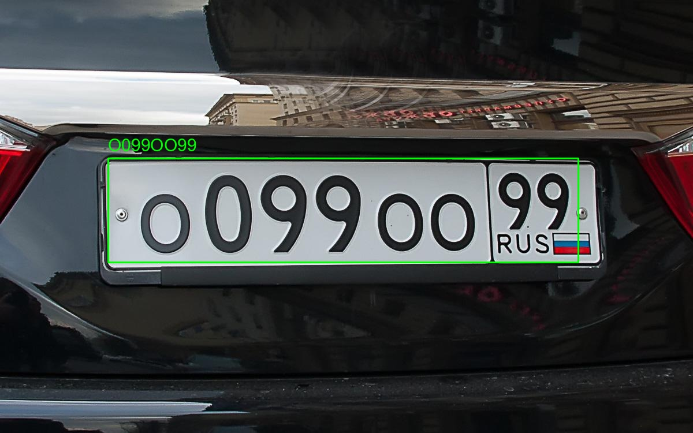
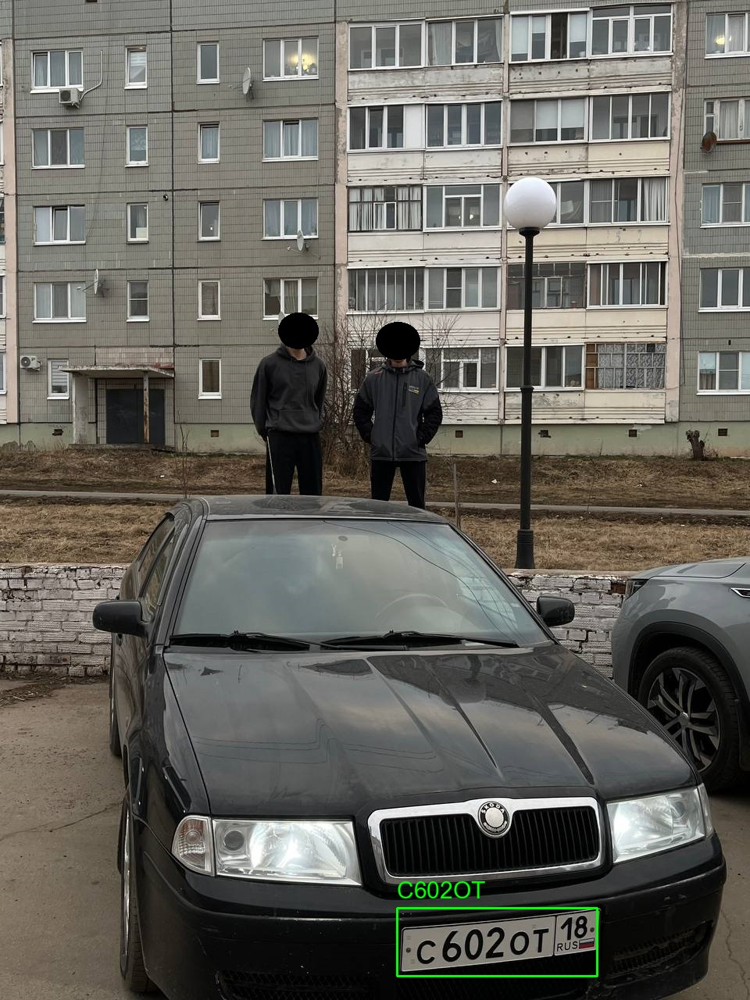
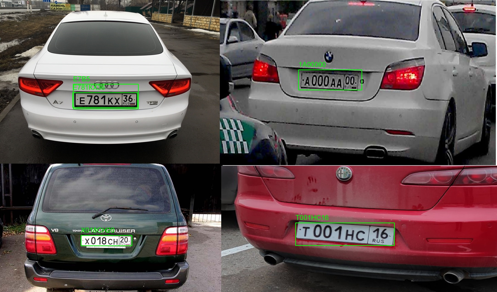

# <h2>Автоматическое обнаружение и распознавание автомобильных номеров</h2>

---

## Цель задания
Разработать Python-приложение, которое:
1. Обнаруживает автомобильные номера на изображениях;
2. Распознает текст с них;
3. Сохраняет данные в JSON-файл.

---

## Требования к функционалу
1.  Входные данные:
     - Изображение (jpeg/png) с одним или несколькими автомобилями.
     - Программа должна работать как с одиночными, так и с пакетами изображений (например, из папки).
2. Обнаружение номера:
     - Найти на изображении области, где находятся номерные знаки.
     - Отметить эти области прямоугольниками (bounding boxes).
3.  Распознавание текста:
     - Извлечь текст с обнаруженных номерных знаков.
     - Учитывать формат номеров: A999AA 116 (для РФ) — но также быть устойчивым к вариациям.
4.  Выходные данные:
     - Вывести в консоль или сохранить в .json файл результат вида:
    ```json
    {
        "filename": "car1.jpg",
        "plates": [
            {
                "box": {
                  "x": 0, 
                  "y": 0, 
                  "width": 50, 
                  "height": 50
                },
                "text": "A123BC 116"
            }
        ]
    }
    ```
   
5.  Визуализация (по желанию):
    - Отобразить изображение с обведёнными рамками и подписью с распознанным текстом.

---


## Стек технологий

- [Python 3.12](https://www.python.org/downloads/release/python-3120/)
- Работа с изображениями: [OpenCV](https://github.com/opencv/opencv), [Pillow](https://github.com/python-pillow/Pillow)
- Обнаружение номеров: [YOLOv8](https://docs.ultralytics.com/ru/models/yolov8/)
- Распознавание текста: [pytesseract(Tesseract OCR)](https://github.com/tesseract-ocr/tesseract)
- Работа с аргументами командной строки: [argparse](https://docs.python.org/3/library/argparse.html)


---


## Установка приложения

Для установки потребуется загрузить пакетный менеджер [uv](https://docs.astral.sh/uv/).

[Загрузка](https://docs.astral.sh/uv/getting-started/installation/)

Для работы pytesseract необходимо установить [Tesseract OCR](https://tesseract-ocr.github.io/tessdoc/Installation.html) на ваше устройство.

В корне проекта запустите следующую команду:
```commandline
uv sync
```

Для запуска программы запустите следующую команду:
```commandline
uv run python src/main.py path_to_image --output_path output_folder
```
где:
- **path_to_image** - путь к папке с изображениями или путь к изображению;
- **output_folder** - (необязательный параметр) папка, в которую нужно сохранить результаты.

Для получения справки, можно запустить следующую команду:
```commandline
uv run python src/main.py -h
```

---

## Результаты работы программы


```json
[
    {
        "filename": "O099OO99.jpeg",
        "plates": [
            {
                "box": {
                    "x": 187,
                    "y": 274,
                    "width": 814,
                    "height": 180
                },
                "text": "О099ОО99"
            }
        ]
    }
]
```
---


```json
[
    {
        "filename": "priora.jpg",
        "plates": [
            {
                "box": {
                    "x": 1123,
                    "y": 2618,
                    "width": 691,
                    "height": 174
                },
                "text": "О770ЕУ18"
            }
        ]
    }
]
```
---

![detected-C602OT18.jpg](license_plates_images/results/C602OT18/detected-C602OT18.jpg)
```json
[
    {
        "filename": "C602OT18.jpg",
        "plates": [
            {
                "box": {
                    "x": 508,
                    "y": 1162,
                    "width": 256,
                    "height": 87
                },
                "text": "С6О2ОТ"
            }
        ]
    }
]
```


```json
[
    {
        "filename": "4_cars.jpg",
        "plates": [
            {
                "box": {
                    "x": 1289,
                    "y": 975,
                    "width": 431,
                    "height": 99
                },
                "text": "Т001НС16"
            },
            {
                "box": {
                    "x": 1302,
                    "y": 305,
                    "width": 276,
                    "height": 88
                },
                "text": "1А00000"
            },
            {
                "box": {
                    "x": 317,
                    "y": 405,
                    "width": 282,
                    "height": 65
                },
                "text": "Е781КХ36"
            },
            {
                "box": {
                    "x": 353,
                    "y": 1030,
                    "width": 222,
                    "height": 45
                },
                "text": "Х018СН20"
            },
            {
                "box": {
                    "x": 319,
                    "y": 368,
                    "width": 284,
                    "height": 108
                },
                "text": "Е7В5"
            }
        ]
    }
]
```

Как видно на примерах, программа не всегда точно обнаруживает автомобильный номер или распознает текст с него.
Это связано с некоторыми причинами, такими как:
- недостаточный объем датасета для обучения моделей;
- расположение автомобильного номера на изображении;
- дефекты на автомобильном номере.